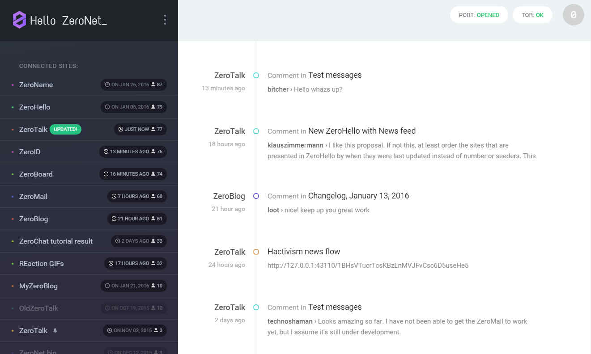
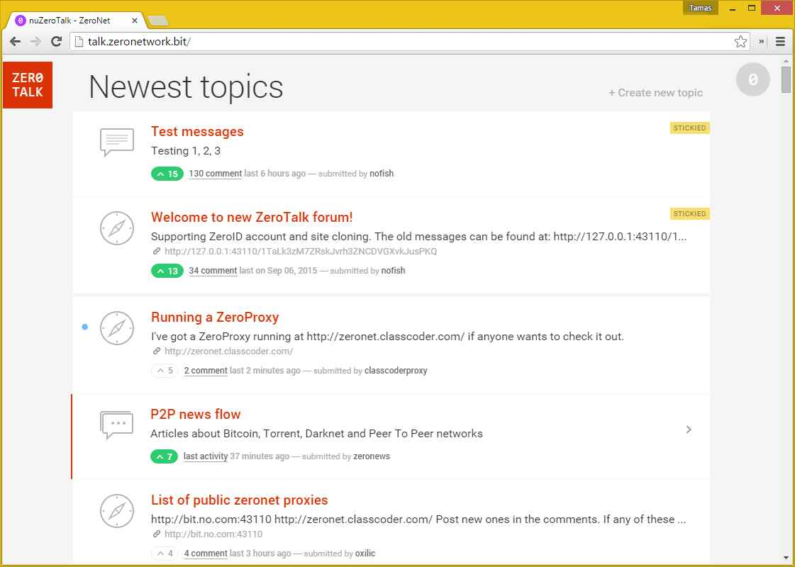

# ¿Que es ZeroNet?

ZeroNet usa la la criptografía Bitcoin y la tecnología BitTorrent para construir una **red descentralizada resistente a la censura**.

Los usuarios pueden publicar sitios estáticos o dinámicos en ZeroNet y los visitantes pueden elegir también servir el sitio web. Los sitios web se mantendrán en linea incluso si esta siendo servido por solo una semilla.

Cuando un sito es actualizado por su dueño, todos los nodos sirviendo a ese sitio (visitantes anteriores) recibirán solo las actualizaciones incrementales hechas al contenido del sitio.

ZeroNet viene con una base de datos SQL integrada. Esto hace que los sitios con contenido pesado sean fáciles de desarrollar. La base de datos también es sincronizada con el que aloja los nodos con las actualizaciones incrementales.

# ¿Por que?

* Creemos en una comunicación incensurable, gratuita y abierta.
* Sin censura: luego de que algo es publicado no hay forma de eliminarlo.
* Ningún punto de fallo: el contenido se mantiene en linea incluso si solo una semilla esta sirviéndolo.
* Imposible de apagar: esta en ningún lado por que esta en todos lados. El contenido es servido por cualquiera que lo desee.
* Rápido: ZeroNet usa la tecnología BitTorrent para entregar un contenido mas rápido que cualquier otro servidor centralizado.
* Funciona fuera de linea: puedes acceder al sitio incluso si tu Internet no esta disponible.
* Seguro: la propiedad del contenido es asegurado usando la misma criptografía que asegura las carteras Bitcoin.

[comment]: <> (Estoy inseguro acerca del siguiente bit. ¿Ideas?)
[comment]: <> (# ¿Que problema esta solucionando ZeroNet?)

[comment]: <> (Cuando Tim Berners-Lee creo el internet, el lo pensó para que fuera gratuito. Sin vigilancia ni censura. Y [el todavía esta luchando por ello](http://www.elespectador.com/tecnologia/inventor-de-world-wide-web-advierte-peligra-libertad-in-articulo-519633).)

[comment]: <> (El Internet es centralizado principalmente en dos lugares: el contenido y los nombres de dominio (URLs) son alojados y controlados por los servidores centrales. Si tu controlas los servidores centrales (y si usted es lo suficientemente potente como lo hace) tu controlas la red.)

[comment]: <> (**Almacenamiento de contenido descentralizado**)

[comment]: <> (ZeroNet aborda el problema de almacenamiento de contenido dando a todos la capacidad de almacenar contenido. Los visitantes del sitio pueden elegir almacenar un sitio web en sus computadoras, y cuando lo hacen también ayudan a servir el sitio a otros usuarios. El sitio está en línea incluso si solo un usuario lo recibe.)

[comment]: <> (**Shared DNS cache**)

[comment]: <> (Las direcciones de los sitios en ZeroNet son puestos en cache por todos los miembros de la red. Cuando tu escribes una dirección de sitio de ZeroNet en tu explorador esto va a llamar a otras semillas conectadas a ti acerca del sitio. Si ninguna de estas semillas parece tener el sitio estos te lo enviaran a ti, si no, ellos seguirán tu pedido con el tuyo.)

[comment]: <> (Esta arquitectura significa que cuando una dirección de sitio es creada, mientras haya al menos una semilla sirviéndola, no hay manera de hacer que el sitio no este disponible.)

# Caracteristicas
 * Fácil, instalación sin necesidad de configuración.
 * Sin contraseñas, autorización basada en [BIP32](https://github.com/bitcoin/bips/blob/master/bip-0032.mediawiki): Tu cuenta esta protegida por la misma criptografía que la cartera Bitcoin.
 * Actualizaciones en tiempo real de los sitios.
 * Soporte para dominio Namecoin .bit.
 * Soporte para bases de datos SQL: Permite un desarrollo de sitios mas fácil y con tiempo de cargas rápidas.
 * Anonimato: soporte total con la red Tor con serviciós ocultos .onion en ves de direcciónes ipv4.
 * Conexiones TLS encriptadas.
 * Apertura automática del puerto uPnP.
 * Complemento para el soporte de múltiples usuarios (openproxy).
 * Funciona con cualquier navegador o sistema operativo.

# ¿Como funciona?

* Luego de que lo instales inicia ZeroNet, abres un sitio visitando (o haciendo clic en el icono de la bandeja del sistema):
  `http://127.0.0.1:43110/{direccion_de_sitio_zeronet}`

  (ej.  `http://127.0.0.1:43110/1HeLLo4uzjaLetFx6NH3PMwFP3qbRbTf3D`).

* Luego ZeroNet usara la red BitTorrent para encontrar semillas que estén sembrando el sitio y descargara el contenido del sitio (HTML, CSS, JS...) de estas semillas.
* Cada sitio visitado esa siendo servido por ti.
* Cada sitio contiene una lista de todos los archivos usados en el sitio en un hash SHA512 y una firma generada usando la llave privada del del dueño del sitio.
* Si el dueño del sitio modifica el sitio, entonces el o ella firmara una nueva lista y lo publicara a las semillas.
* Luego de que las semillas han verificado la integridad de la lista de archivos (usando la firma), estos descargaran los archivos modificados y publicara el contenido a otras semillas.
##### [Diapositivas sobre la criptografía ZeroNet, actualización de contenido, sitios de múltiples usuarios &raquo;](./pdf/zeronet_presentacion.pdf)

# Capturas de pantalla

##### [Mas capturas de pantalla &raquo;](/usando_zeronet/sitios_de_muestra/)

# Limitaciones actuales

* No es igual que un torrent, no hay soporte para la separación de grandes archivos
* No hay sitios privados

# Ayuda a mantener este proyecto con vida

Bitcoin: 1QDhxQ6PraUZa21ET5fYUCPgdrwBomnFgX

### ¡Gracias!

* Para mas información, ayuda, lista de cambios, sitios ZeroNet (solo en ingles): [http://www.reddit.com/r/zeronet/](http://www.reddit.com/r/zeronet/)
* Ven y chatea con nosotros: [#zeronet @ FreeNode](https://kiwiirc.com/client/irc.freenode.net/zeronet) o en [gitter](https://gitter.im/HelloZeroNet/ZeroNet)
